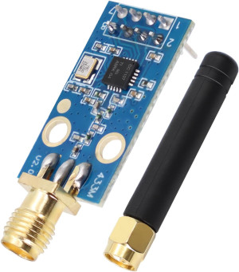

# Basic idea

Capture the signals from the remote control and replay them from a smart device whenever wanted.

# Capture the signals

They were captured with a [Flipper Zero](https://en.wikipedia.org/wiki/Flipper_Zero) using Sub-GHz radio scanning.
I also contributed them [here](https://github.com/UberGuidoZ/Flipper/tree/main/Sub-GHz/Cooker_Hoods/Elica).

# Replay the signals

## Hardware

I'm using a TI CC1101 transceiver and a Wemos D1 mini board:

Pinout for the CC1101:

Pin 7 on the CC1101 is actually MISO.
Seems to be a typo on the image.

This is the actual wiring. I found it at [SmartRC-CC1101-Driver-Lib](https://github.com/LSatan/SmartRC-CC1101-Driver-Lib):

SmartRC-CC1101-Driver-Lib is also the awesome library that I'm using.

# Integration into Home Assistant

The fan is integrated via the [MQTT Fan](https://www.home-assistant.io/integrations/fan.mqtt) integration.
The light is integrated via the [MQTT Light](https://www.home-assistant.io/integrations/light.mqtt) integration.

I am using [this yaml](mqtt_fan.yaml).
