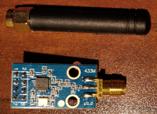
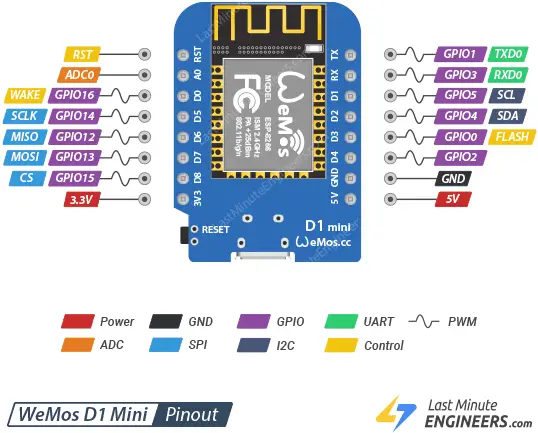

# Basic idea

Capture the signals from the remote control and replay them from a smart device whenever wanted.

# Capture the signals

They were captured with a [Flipper Zero](https://en.wikipedia.org/wiki/Flipper_Zero) using Sub-GHz radio scanning.
I also contributed them [here](https://github.com/UberGuidoZ/Flipper/tree/main/Sub-GHz/Cooker_Hoods/Elica).

# Replay the signals

## Hardware

### Parts

I'm using a TI CC1101 transceiver and a Wemos D1 mini board:

Pinout for the CC1101:

Pin 7 on the CC1101 is actually MISO.
Seems to be a typo on the image.

### Wiring

This is the actual wiring. I found it at [SmartRC-CC1101-Driver-Lib](https://github.com/LSatan/SmartRC-CC1101-Driver-Lib):

SmartRC-CC1101-Driver-Lib is also the awesome library that I'm using.

## Software

Here is where I found how to send a recording from Flipper Zero: [simondankelmann/Esp32-SubGhz](https://github.com/simondankelmann/Esp32-SubGhz).

One very interesting section is [Transmit Flipper Zero .sub Files](https://github.com/simondankelmann/Esp32-SubGhz/blob/main/Esp32/Esp32-CC1101-Standalone/README.md#transmit-flipper-zero-sub-files).
This and the sketch [ESP32_CC1101_STANDALONE.ino](https://github.com/simondankelmann/Esp32-SubGhz/blob/main/Esp32/Esp32-CC1101-Standalone/ESP32_CC1101_STANDALONE/ESP32_CC1101_STANDALONE.ino) helped me a lot to understand what's what.

[homieiot/homie-esp8266](https://github.com/homieiot/homie-esp8266) is used for the MQTT communication.

# Integration into Home Assistant

The fan is integrated via the [MQTT Fan](https://www.home-assistant.io/integrations/fan.mqtt) integration.
The light is integrated via the [MQTT Light](https://www.home-assistant.io/integrations/light.mqtt) integration.

I am using [this yaml](mqtt_fan.yaml).

# Open points

* I don't understand why we are using `digitalWrite` to do the actual sending and not some method of `ELECHOUSE_cc1101`.
* Sometimes the D1 mini crashes. This seems to happen when the network task wants to do something while the fan speed is currently being changed. How can this be handled better?
